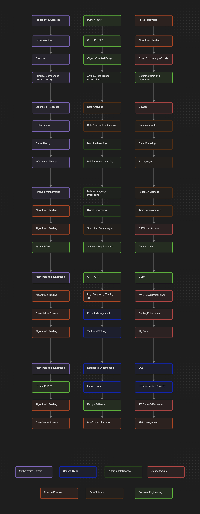

# Learning Roadmap for Algorithmic Trading and Quantitative Development

## Overview

This roadmap is designed to systematically guide my learning journey across multiple domains related to algorithmic trading, quantitative finance, data science, and software engineering. By splitting the year into four terms and focusing on three topics simultaneously, I aim to build a strong foundation and progressively acquire advanced skills.

---

## Learning Structure

- **Yearly Plan**: The year is divided into four terms, each lasting three months.
- **Focus Areas per Term**: Each term will focus on three topics, ensuring balanced progress across multiple domains.
- **Sequential Flow**: Topics are studied sequentially, building on prerequisites and ensuring foundational knowledge is mastered before advancing.
- **Hands-On Learning**: Projects, assignments, and practical applications will be prioritized to reinforce theoretical knowledge.

---

## Term Schedule Across All Years

### **Year 1**

#### **Term 1: January - March**
1. **Mathematics Domain**: Probability and Statistics  
2. **Artificial Intelligence Domain**: Python PCAP (Programming Essentials)  
3. **Data Science Domain**: Data Science Foundations  

#### **Term 2: April - June**
1. **Mathematics Domain**: Linear Algebra  
2. **Artificial Intelligence Domain**: Artificial Intelligence Foundations  
3. **Cloud/DevOps Domain**: Cloud Computing (Cloud+)  

#### **Term 3: July - September**
1. **Mathematics Domain**: Calculus  
2. **Artificial Intelligence Domain**: Machine Learning  
3. **Data Science Domain**: Data Analytics  

#### **Term 4: October - December**
1. **Artificial Intelligence Domain**: Deep Neural Networks  
2. **Software Engineering Domain**: Object-Oriented Design  
3. **Finance Domain**: Algorithmic Trading  

---

### **Year 2**

#### **Term 1: January - March**
1. **Mathematics Domain**: Principal Component Analysis (PCA)  
2. **Artificial Intelligence Domain**: Reinforcement Learning  
3. **Data Science Domain**: Data Visualization  

#### **Term 2: April - June**
1. **Mathematics Domain**: Stochastic Processes  
2. **Artificial Intelligence Domain**: Natural Language Processing  
3. **Software Engineering Domain**: Data Structures and Algorithms  

#### **Term 3: July - September**
1. **Mathematics Domain**: Optimization  
2. **Artificial Intelligence Domain**: Signal Processing  
3. **Finance Domain**: Forex (Babypips)  

#### **Term 4: October - December**
1. **Mathematics Domain**: Game Theory  
2. **Cloud/DevOps Domain**: DevOps  
3. **Data Science Domain**: Statistical Data Analysis  

---

### **Year 3**

#### **Term 1: January - March**
1. **Mathematics Domain**: Information Theory  
2. **Cloud/DevOps Domain**: Git/GitHub Actions  
3. **Software Engineering Domain**: C++ Fundamentals (CPE, CPA)  

#### **Term 2: April - June**
1. **Finance Domain**: Financial Mathematics  
2. **Software Engineering Domain**: Technical Writing  
3. **Cloud/DevOps Domain**: Docker/Kubernetes  

#### **Term 3: July - September**
1. **Mathematics Domain**: Mathematical Foundations  
2. **Cloud/DevOps Domain**: AWS Practitioner  
3. **Software Engineering Domain**: Design Patterns  

#### **Term 4: October - December**
1. **Finance Domain**: Algorithmic Trading  
2. **Software Engineering Domain**: Portfolio Optimization  
3. **Cloud/DevOps Domain**: Big Data  

---

### **Year 4**

#### **Term 1: January - March**
1. **Mathematics Domain**: Advanced Mathematical Foundations  
2. **Cloud/DevOps Domain**: Linux+  
3. **Software Engineering Domain**: CUDA Programming  

#### **Term 2: April - June**
1. **Finance Domain**: Quantitative Finance  
2. **Cloud/DevOps Domain**: AWS Developer Certification  
3. **Data Science Domain**: Time Series Analysis  

#### **Term 3: July - September**
1. **Finance Domain**: Algorithmic Trading (Advanced)  
2. **Data Science Domain**: Research Methods  
3. **Software Engineering Domain**: Concurrency  

#### **Term 4: October - December**
1. **Finance Domain**: High-Frequency Trading (HFT)  
2. **Cloud/DevOps Domain**: Cybersecurity (Security+)  
3. **Software Engineering Domain**: Risk Management  

---

## Tools and Resources

### **Programming Languages**
- Python
- R
- C++
- SQL

### **Key Libraries**
- `numpy`, `pandas`, `matplotlib` for Data Science
- `tensorflow`, `keras`, `scikit-learn` for AI and Machine Learning
- `pywavelets` and `scipy` for Signal Processing

### **Learning Resources**
1. **Books**: Refer to the recommended textbooks within each domain.
2. **Online Courses**: Complete the curated courses listed in each domain folder.
3. **Projects**: Work on domain-specific projects to reinforce learning and gain practical experience.

---

## Roadmap Visualization

---

## Progress Tracking

- Use this repository to organize notes, projects, and progress reports for each term.
- Update the roadmap visualization to reflect completed topics.
- Regularly review and refine the learning plan to align with evolving goals.

---

## Final Note

This roadmap provides a structured, multi-year approach to mastering algorithmic trading and quantitative development. By following the outlined plan, I aim to build a robust knowledge base and practical skills for implementing advanced trading systems and financial models.

